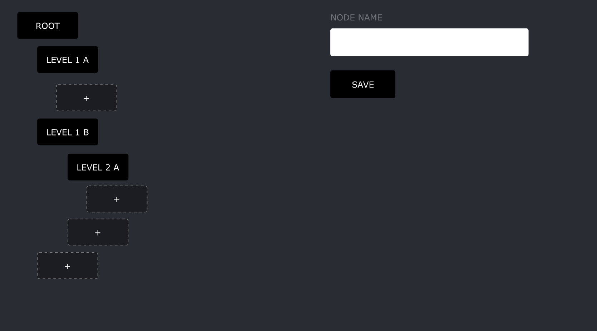

# Coding Test _ FrontEnd Round 1

Tree Builder

### How to submit the test

Create an PR from your own code branch and assign to me `@longtran-pops` before the deadline.

### Requirements

- Build a nested tree as shown belows



- Add new Node
  - When User click on `+` Button
  - Then text input on the right side will be active.
  - When User enter the node name into the input and press "Save"
  - Then a New node will be inserted at the position that User has been clicked

### What can you do?

- You can refactor and edit everything As long as your code can full fill the requrirement. If you add any other library/third party, please mention it in the PR and explain why would you use it.

### Notes

PR Template:

```
Added:
 - General idea of what you have added such as an utility function, base component or so and why do you need to add them.
Refactored
 - General idea of what you have refactored such as move a function from component A to component B and why do you need to do that.
```